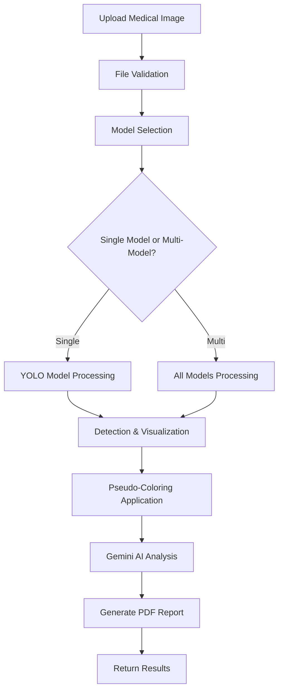
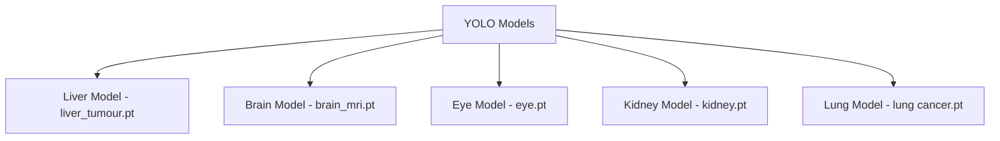

<div align="center">

# 🏥 MedVisionAI
### Advanced Medical Image Analysis System

[](https://python.org)
[](https://flask.palletsprojects.com)
[](https://ultralytics.com)
[](https://ai.google.dev)
[](LICENSE)

**AI-Powered Medical Diagnostics for the Modern Healthcare**

[🚀 Live Demo](#) • [📖 Documentation](#) • [🐛 Report Bug](#) • [✨ Request Feature](#)

</div>


## 🌟 Overview

MedVisionAI revolutionizes medical imaging with AI-powered diagnostic precision. Our system combines state-of-the-art YOLO segmentation models with Google's Gemini AI to provide comprehensive analysis of medical scans including CT, MRI, X-ray, and ultrasound images.

### 🎯 Key Features

- **🔬 Multi-Modal Analysis**: Support for liver, brain MRI, eye, kidney, and lung imaging
- **⚡ Real-time Detection**: Instant analysis with confidence scoring and visualization
- **🤖 AI-Powered Insights**: Integration with Google Gemini AI for professional interpretations
- **📄 Automated Reports**: PDF reports with findings, confidence scores, and recommendations
- **🎨 Advanced Visualization**: Pseudo-coloring and bounding box visualization
- **🌐 Web Interface**: User-friendly Flask web application
- **📊 Batch Processing**: Support for multiple model analysis on single images

<div align="center">
  
</div>


## 📋 Table of Contents

- [🌟 Overview](#-overview)
- [🏥 Supported Medical Conditions](#-supported-medical-conditions)
- [🏗️ System Architecture](#️-system-architecture)
- [⚙️ Installation](#️-installation)
- [🔧 Configuration](#-configuration)
- [🚀 Usage](#-usage)
- [📡 API Endpoints](#-api-endpoints)
- [🛠️ Technologies Used](#️-technologies-used)
- [📁 Code Structure](#-code-structure)
- [🌐 Deployment](#-deployment)
- [🤝 Contributing](#-contributing)
- [📄 License](#-license)

## 🏥 Supported Medical Conditions

| **Organ** | **Conditions Detected** | **Applications** |
|-----------|------------------------|------------------|
| 🫀 **Liver** | Liver tumors, normal tissue | Hepatocellular carcinoma detection, liver health assessment |
| 🧠 **Brain MRI** | Brain tumors, anatomical structures | Neurological disorder diagnosis, tumor detection |
| 👁️ **Eye** | Cataract, Diabetic Retinopathy, Glaucoma, Normal | Ophthalmological screening, preventive care |
| 🫘 **Kidney** | Kidney stones | Urological assessment, stone detection |
| 🫁 **Lung** | Lung tumors/cancer | Pulmonary oncology, early cancer detection |

## 🏗️ System Architecture

### Workflow Diagram

### Model Inventory

### Key Components
- **Image Upload & Validation**: Secure file handling with format verification
- **Multi-Model Detection**: Parallel processing across specialized YOLO models
- **Visualization Engine**: Bounding box rendering with pseudo-coloring for anomalies
- **AI Analysis**: Google Gemini integration for medical insights
- **Report Generation**: Automated PDF creation with comprehensive findings

## ⚙️ Installation

### 📋 Prerequisites

- **Python** 3.8 or later
- **pip** (Python package installer)
- **CUDA-compatible GPU** (recommended for faster inference)
- **Git** (for cloning the repository)

### 🚀 Quick Start

```bash
# 1. Clone the repository
git clone https://github.com/kknani24/medicure-ai-.git
cd MedVisionAI-main

# 2. Create virtual environment
python -m venv venv

# 3. Activate virtual environment
# On Windows:
venv\Scripts\activate
# On macOS/Linux:
source venv/bin/activate

# 4. Install dependencies
pip install -r requirements.txt

# 5. Run the application
python application.py
```

### 📦 Manual Installation

<details>
<summary>Click to expand detailed installation steps</summary>

#### Step 1: Clone the Repository
```bash
git clone https://github.com/kknani24/medicure-ai-.git
cd MedVisionAI-main
```

#### Step 2: Create Virtual Environment
```bash
python -m venv venv
source venv/bin/activate  # On Windows: venv\Scripts\activate
```

#### Step 3: Install Required Packages
```bash
pip install -r requirements.txt
```

#### Step 4: Verify Installation
```bash
python -c "import application; print('✅ Installation successful!')"
```

</details>

## 🔧 Configuration

### 🔑 Environment Setup

Create a `.env` file in the project root:

```env
# Google Gemini API Key
# Get your API key from: https://makersuite.google.com/app/apikey
GEMINI_API_KEY=your_google_gemini_api_key_here

# Flask Configuration
FLASK_ENV=development
FLASK_DEBUG=True
```

### 📁 Model Files

Ensure all YOLO model files are present in the `models/` directory:

```
models/
├── liver_tumour.pt      # Liver tumor detection
├── brain_mri.pt         # Brain MRI analysis
├── eye.pt               # Eye condition detection
├── kidney.pt            # Kidney stone detection
└── lung cancer.pt       # Lung cancer detection
```

### Step 3: Directory Structure
```
MedVisionAI-main/
├── application.py
├── .env
├── requirements.txt
├── static/
│   └── uploads/
├── templates/
│   ├── index.html
│   └── simulate.html
├── models/
│   ├── liver_tumour.pt
│   ├── brain_mri.pt
│   ├── eye.pt
│   ├── kidney.pt
│   └── lung cancer.pt
└── README.md
```

## 🚀 Usage

### 🖥️ Web Interface

1. **Start the Application**
   ```bash
   python application.py
   ```

2. **Access the Interface**
   - Open your browser and navigate to `http://localhost:5000`
   - The application will be running in debug mode

3. **Upload and Analyze**
   - Select a medical image (PNG, JPG, JPEG formats supported)
   - Choose a specific model or leave blank for multi-model analysis
   - Click "Analyze Image" to process
   - View results, AI insights, and download the PDF report

### 🎮 Simulation Mode

Access the surgical simulation interface at `http://localhost:5000/simulate` for advanced medical procedure training.

### Command Line Usage
For programmatic access, you can also use the API endpoints directly:

```python
import requests

# Upload and analyze image
files = {'file': open('medical_scan.jpg', 'rb')}
data = {'model': 'liver'}  # Optional: specify model
response = requests.post('http://localhost:5000/detect', files=files, data=data)
result = response.json()
```

## 📡 API Endpoints

### POST /detect
Analyzes uploaded medical images and returns detection results.

**Parameters:**
- `file` (required): Medical image file (PNG, JPG, JPEG)
- `model` (optional): Specific model to use ('liver', 'brain_mri', 'eye', 'kidney', 'lung')

**Response:**
```json
{
    "message": "Detection completed",
    "original_image": "/static/uploads/scan.jpg",
    "processed_image": "/static/uploads/processed_scan.jpg",
    "detections": {
        "liver": [
            {
                "class": "tumor",
                "confidence": 0.87,
                "bbox": [150, 200, 300, 350]
            }
        ]
    },
    "gemini_response": "AI medical analysis...",
    "pdf_report": "/static/uploads/report_scan.pdf"
}
```

## 🛠️ Technologies Used

### 🧠 Core Technologies

| **Technology** | **Version** | **Purpose** |
|----------------|-------------|-------------|
| **Python** | 3.8+ | Backend development |
| **Flask** | 2.3.3 | Web framework |
| **YOLO** | 8.0.200 | Object detection models |
| **PyTorch** | 2.0.1 | Deep learning framework |
| **OpenCV** | 4.8.1 | Image processing |
| **Google Gemini** | Latest | AI medical insights |
| **ReportLab** | 4.0.4 | PDF report generation |

### 🔬 AI/ML Stack

- **YOLO (You Only Look Once)**: State-of-the-art real-time object detection
- **PyTorch**: Deep learning framework for model inference
- **Google Gemini AI**: Advanced language model for medical analysis
- **OpenCV**: Computer vision and image processing
- **NumPy**: Numerical computing and array operations

### Google Gemini AI


Google's Gemini AI provides advanced multimodal understanding capabilities. In our system, it analyzes medical images alongside detection results to generate professional medical insights, treatment recommendations, and diagnostic interpretations with the expertise of a seasoned clinician.

### Flask


Flask serves as the web framework powering our medical analysis platform. Its lightweight nature and extensive ecosystem make it perfect for creating responsive web applications that can handle medical image processing workflows efficiently.

### OpenCV


OpenCV handles all computer vision operations including image loading, processing, visualization, and pseudo-coloring. Its optimized algorithms ensure fast image manipulation and enhancement, crucial for real-time medical image analysis.


## 📁 Code Structure

```
MedVisionAI-main/
├── application.py            # Main Flask application
├── static/
│   └── uploads/              # Uploaded and processed images
├── templates/
│   ├── index.html            # Main web interface template
│   └── simulate.html         # Simulation interface template
├── models/                   # YOLO model files
├── requirements.txt          # Python dependencies
├── .env                      # Environment variables
└── README.md                # Project documentation
```

### Key Functions

- **`allowed_file()`**: Validates uploaded file formats
- **`process_image()`**: Main image processing pipeline
- **`process_multiple_model_results()`**: Handles multi-model analysis
- **`generate_response_with_image()`**: Interfaces with Gemini AI
- **`create_pdf_report()`**: Generates comprehensive PDF reports

## 🌐 Deployment

### 🚀 Quick Deployment Options

| **Platform** | **Free Tier** | **Custom Domain** | **SSL** | **Difficulty** |
|--------------|---------------|-------------------|---------|----------------|
| **Render** | ✅ | ✅ | ✅ | Easy |
| **Railway** | ✅ | ✅ | ✅ | Easy |
| **Heroku** | ❌ | ✅ | ✅ | Medium |
| **DigitalOcean** | ❌ | ✅ | ✅ | Medium |

### 📋 Deployment Checklist

- [ ] Update `.env` with production API keys
- [ ] Test application locally
- [ ] Ensure all dependencies are in `requirements.txt`
- [ ] Configure environment variables on hosting platform
- [ ] Set up custom domain and SSL
- [ ] Test deployed application

### 🔧 Environment Variables for Production

```env
GEMINI_API_KEY=your_production_api_key
FLASK_ENV=production
FLASK_DEBUG=False
PORT=5000
```

For detailed deployment instructions, see [deploy.md](deploy.md).

## 🤝 Contributing

We welcome contributions to improve MediCure-AI! Here's how you can contribute:

1. **Fork the Repository**
```bash
git fork https://github.com/kknani24/medicure-ai-.git
```

2. **Create a Feature Branch**
```bash
git checkout -b feature/amazing-feature
```

3. **Make Your Changes**
- Add new medical models
- Improve detection accuracy
- Enhance UI/UX
- Add new features

4. **Commit Your Changes**
```bash
git commit -m "Add amazing feature"
```

5. **Push to the Branch**
```bash
git push origin feature/amazing-feature
```

6. **Open a Pull Request**

### Areas for Contribution
- **Model Enhancement**: Improve existing models or add new medical condition detection
- **UI/UX Improvements**: Enhance the web interface and user experience
- **Performance Optimization**: Optimize inference speed and memory usage
- **Documentation**: Improve documentation and add tutorials
- **Testing**: Add comprehensive test coverage

## 📄 License

This project is licensed under the MIT License. See the [LICENSE](LICENSE) file for details.

---

<div align="center">

### 🌟 Star this repository if you found it helpful!

**Made with ❤️ for the medical community**

[](https://github.com/kknani24/medicure-ai-)
[](https://github.com/kknani24/medicure-ai-/fork)
[](https://github.com/kknani24/medicure-ai-)

</div>

## Disclaimer

⚠️ **Important Medical Disclaimer**: This AI system is designed to assist healthcare professionals and should not be used as a substitute for professional medical diagnosis or treatment. Always consult with qualified healthcare providers for medical decisions. The system is intended for educational and research purposes and should undergo proper clinical validation before use in medical practice.

---

**© 2025 MediCure-AI. All rights reserved.**

For questions, support, or collaboration opportunities, please open an issue or contact the development team.
#
